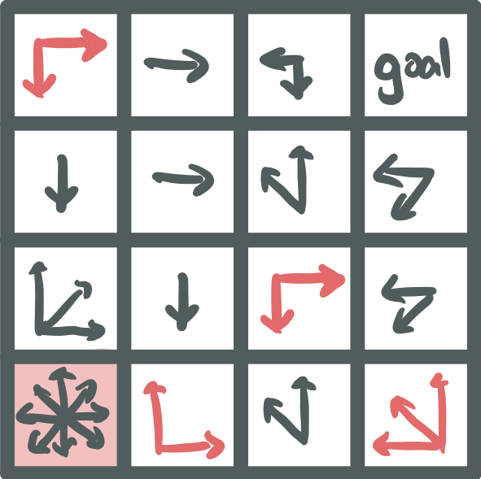
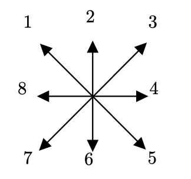
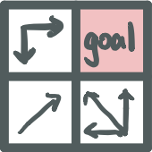
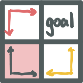
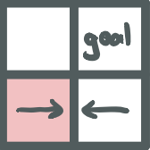
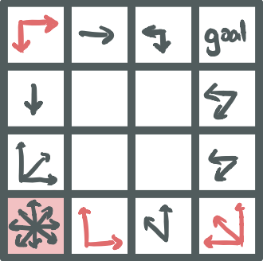
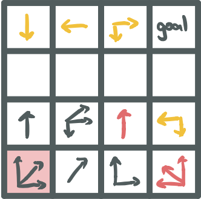
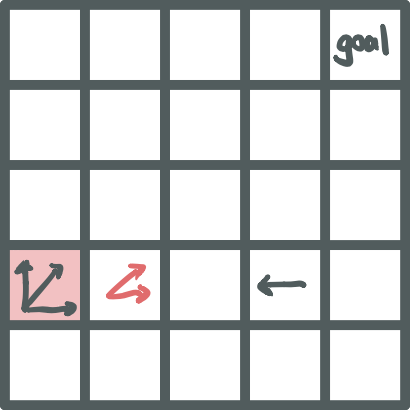

# Alice Maze Solver

## What are Alize Mazes?

Alice Mazes are puzzles created by Robert Abbott. 

> These are called “Alice” mazes because they recall the scene in ***Alice in Wonderland*** where Alice eats a piece of cake with the sign “Eat Me” and grows larger, then she drinks from a bottle marked “Drink Me” and becomes smaller. These mazes won’t make you larger or smaller, but the distance you travel in a move will get larger or smaller. [^1]

This is an example of the Alice Mazes:

[^1]: https://www.logicmazes.com/alice.html

## Alice Maze Rules

- You start at the block with **red backround colour** and having the **step size** [^2]of **1**.
- You **can** move to the direction of the arrow points to, and you **cannot** move to the outside of the boundary.
- When stepped on the block with **red** arrow , then **step size** increase by 1.
- When stepped on the block with **yellow** arrow, then **step size** increase by 1.
- When **goal** block is stepped, the game stops.
- The goal is finding solution with the **fewest steps**[^3].

​	

[^2]: Step size is the number of blocks to move. For example, when step size is 2 and move upward, them move up 2 blocks. 
[^3]: Please note here, the fewest steps do not mean the least step size. Step here mean number of movements. For example, if a movement moves up two blocks because step size is 2, step count increases by 1. 

## Maze Representation

The file stores maze in a csv format[^4]:

- The first line is a integer which represents the size of maze: let size of

  maze be n.

- The second line has two numbers and each represents the x and y coordi-

  nate of the initial(staring) position.

- The third line has two numbers and each represents the x and y coordinate of the goal position.

- From forth line to (4 + n)th line, contains n × n pairs of data. Each pair has a letter and a number: letter, number. Letters are only from the set: {R,Y,B,G,N}, where R stands for Red Arrow, Y stands for Yellow Arrow, B stands for Black Arrow, G stands for Goal, and N stands for no arrows. The numbers are direction of arrows: 

  

  Each number represents a direction as the image shown and 0 represents no directions. If there are multiple arrows at the same location, then on number is concatenated to one other. i.e. If there are directions of top(2) and right(4). Then 24 will represent it.

- After the file is loaded, a tuple will be returned and stores all information: 

  `(maze_size, initial_x, initial_y, maze_grid, final_x, final_y)`

  - `maze_size`: stores the size of the maze.
  - `initial_x`: the initial location (x-axis) where Alice is at.
  - `initial_y`: the initial location (y-axis) where Alice is at.
  - `final_x`: the initial location (x-axis).
  - `final_y`: the initial location (y-axis).
  - maze grid: is a n × n 2D list represents the maze. Every (i, j) entry in maze grid, where i, j ∈ N and i, j < n, stores the arrow informa- tion on each respective location. i.e. the (0,0) entry of maze grid represents the first row’s first block; (1, 0) entry of maze grid repre- sents the second row’s first block; (n − 1, n − 1) entry of maze grid represents the nth row’s nth block. Within each block, it stores a list has five items:
    - `arrow_colour`: stores the arrow colour of current location
    - `arrow_direction_code`: stores the code represents the arrow’s di- rection; need to call code2direction() for interchanging the code to actual direction.
    - `step_count_list`: stores all minimal step count that visited this location. It is useful when we can get the minimum steps to achieve the goal fast.
    - `previous_list`: stores all (previous x, previous y) which are node came from to current location. (the origin come from) It is useful when we trace back from the goal.
    - `step_size_list`: stores all unique step size that visited this loca- tion. It is useful when one of location is required to step twice.

[^4]: In my solution, it only solves the square mazes

## Algorithm

There are two parts of my algorithm to find the shortest solution:

1. Load and interpret the maze.txt file and store it in a 2D list.

2. Store the path in the 2D array, with taking the input of the 2D list which represents the maze.

3. Trace back the path in the 2D list to find the shortest solution.

Part 1 is explained in **Matrix Representation**, so we dive into part 2 and 3 .

***

The algorithm is an adapted DFS algorithm. There are more parameters com- pare to regular DFS:

- `previous_x`: the previous location (x-axis) where Alice is came from.

- `previous_y`: the previous location (y-axis) where Alice is came from.

- `maze_size`: stores the size of the maze.

- `curr_x`: the current location (x-axis) where Alice is at.

- `curr_y`: the current location (y-axis) where Alice is at.

- `maze_grid`: the 2D array that stores every arrow’s colour, blocks’ arrows,

  and the minimal steps required to visit

- `step_size`: the step size for next step.

- `step_count`: the total steps that moved so far.

***

Differ from the regular DFS, there are 5 more base cases added (The order matters):

1. When the current location is outside of the maze, then this move is invalid and there are no future moves.
2. When the current location has no direction arrows, then this step is invalid and there are no future moves.
3. When the current location is the goal than this move is valid but there are no future moves and if `step_count` is smaller than `step_count` stored in current location or current location is never visited, then `Update()`.
4. When the current location is once visited before with the same step size, which means the `step_size_list` stored in current location contains `step_size`, and stepcount stored in current location is smaller than `step_count`, there are no future steps and no `Update()`.
5. When `step_size` is 0, there are no future steps.

Otherwise, we `Update()` on current location.

`Update()`will do:

- If the current location is never visited, replace the *infinity* (the first element in `step_count_list` stored in current location) to `step_count`, append `step_size` to `step_size_list` stored in current location, and append `(previous_x, previous_y)` to `previous_list` stored in current location.
- If the current location is visited because `step_size_list` stored in current location contains `step_size` (Since we did not reach the base case, we can assume step count stored in current location is greater than `step_count`), then replace the corresponding `step_count` and `(previous_x, previous_y)` in step `size_list` and `previous_list` stored in current location.

***

Then checking the current location’s arrows: If red: `step_size += 1`; If yellow: `step_size -= 1`; Else: do nothing with step size. Then loop every possible out-going direction. For every direction, we call make a `move()` to update the value in `curr_x` and `curr_y`; and `step_count += 1`. Then we call self recursively with new set of parameters. The algorithm will finally stop when all possible paths are reached.

---

The part 3 is tracing the path reversely to find the path. The whole part 3 is done in the wrapper function of DFS algorithm. It takes another two parameters:

- `final_x`: The goal location (x-axis) 

- `final_y`: The goal location (y-axis)

The algorithm traces reversely which from the goal to initial and the minimum steps required is also stored in that 2D list. Lastly the algorithm prints out the path.

## Examples

There are 6 interesting mazes for testing.

1. First test is testing when the goal and staring position are the same. This maze is simple and the algorithm should not step on any other locations but return. This checked if the algorithm will reach the goal than return. 

   

   1. Expected result: (0, 1)→ (0, 1), 0 
   2. Actual result: (0, 1)→ (0, 1), 0

2. Second test is testing two conditions: if red and yellow arrows enlarge the step or reduce the step size and if the algorithm detects no solutions. 

   

   1. Expected result: No solution 
   2. Actual result: No solution

3. Third test is testing if the algorithm detects no solutions. Every location is able to revisit, and the algorithm needs to determine if the revisit is revisit-able.

   

   1. Expected result: No solution
   2. Actual result: No solution

4. Fourth test is testing if the algorithm able to find the correct way to the goal. There are many directions and non-visit-able locations.

   

   1. Expected result: (3, 0)→ (3, 1)→ (3, 3)→ (0, 3), 3
   2. Actual result: (3, 0)→ (3, 1)→ (3, 3)→ (0, 3), 3

5. Fifth test is testing is the algorithm able to find the correct way to the goal. There is a row of blank. The only way there is by finding the red-arrow to get over it.

   

   - Expected result: (3, 0)→ (2, 1)→ (2, 2)→ (0, 2)→ (0, 3), 4
   - Actual result: (3, 0)→ (2, 1)→ (2, 2)→ (0, 2)→ (0, 3), 3

6. Sixth test is a simplified maze that testing revisiting. When running complex mazes, it is very often to visit the same location more times than once. It is a simplified version of testing if reaching the goal requires revisiting. 

   

   1. Expected result: (3, 0)→ (3, 1)→ (3, 3)→ (3, 1)→ (0, 4), 4 
   2. Actual result: (3, 0)→ (3, 1)→ (3, 3)→ (3, 1)→ (0, 4), 4
